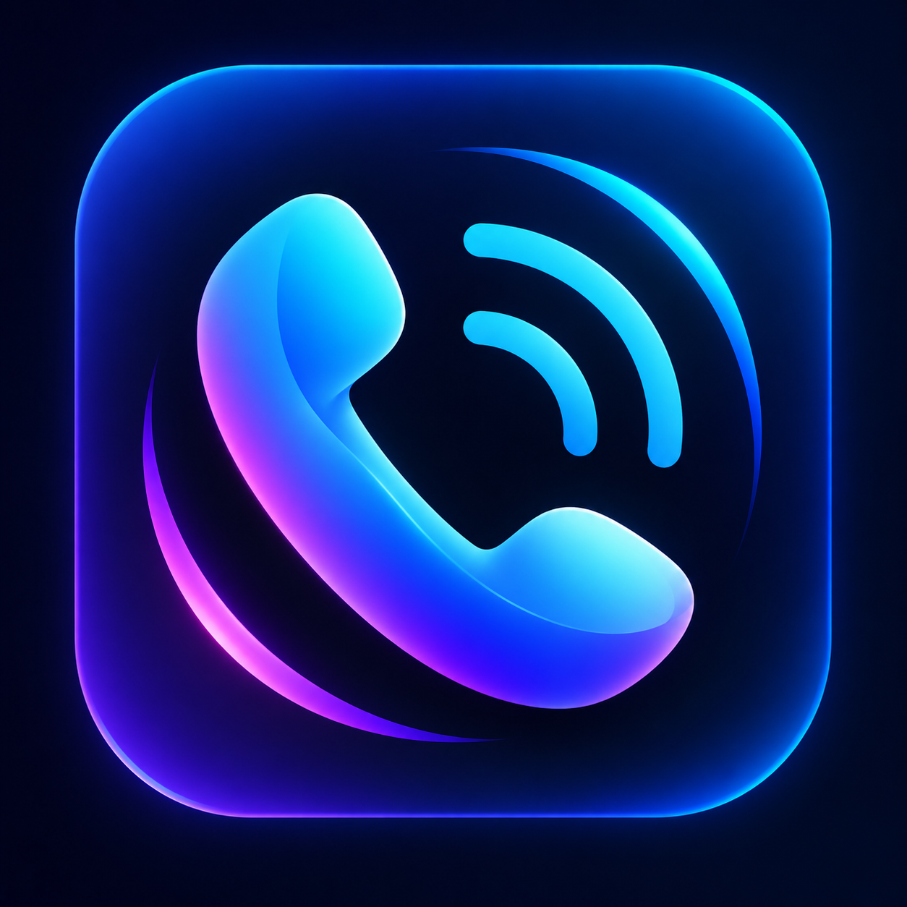

# 📞 ConnectCall

<p align="center">
  
</p>

<h2 align="center">🚀 Real-Time Audio & Video Calling Application</h2>

<p align="center">
  A modern Flutter communication app built with Firebase, WebRTC, FCM and Riverpod.
</p>

<p align="center">
  
  
  
  
  
  
</p>

<p align="center">
  
  
</p>

---

## 📱 App Screenshots

<p align="center">
  
  
  
  
</p>

<p align="center">
  
  
  
  
</p>

<p align="center">
  
  
  
  
</p>

<p align="center">
  
  
  
</p>

---

## 🎬 Demo

<p align="center">
  <a href="assets/screen_recording/calling_app_demo.mp4">
    
  </a>
</p>

<p align="center">
  <b>▶ Click the preview above to watch the complete app demonstration.</b>
</p>

---

## ✨ Overview

**ConnectCall** is a Flutter-based real-time communication application designed for seamless **audio and video calling**.

The application combines **Flutter, Firebase, WebRTC, Firebase Cloud Messaging, Riverpod, GoRouter and SharedPreferences** to provide a smooth and responsive calling experience with real-time call status synchronization.

### 🎯 What ConnectCall Provides

- 🔐 Secure user authentication
- 👥 Contact management
- 🔎 User search
- 🟢 Online/offline status
- 📞 Real-time audio calling
- 🎥 Real-time video calling
- 🔔 Incoming call notifications
- 📊 Call history
- ⏱️ Call duration tracking
- 🌙 Light & Dark themes
- 🔄 Real-time call-state synchronization

---

# 🚀 Features

## 🔐 Authentication

- Firebase Authentication
- Login
- Signup
- User profile creation
- Profile completion flow
- Secure user sessions

---

## 👥 Contacts

- Search users
- Add contacts
- Contact list
- User profile information
- Online/offline status

---

## 📞 Audio & Video Calling

- 📱 Audio calling
- 🎥 Video calling
- 📲 Incoming call screen
- ✅ Accept calls
- ❌ Decline calls
- 🔴 End calls
- ⏱️ Call duration tracking
- 🔄 Real-time call status synchronization
- 🧹 Automatic call cleanup
- 📵 Missed call handling

---

## 🔔 Notifications

- Firebase Cloud Messaging
- Incoming call notifications
- Background call handling
- Native CallKit integration
- Call accept / decline actions
- Push notification synchronization

---

## 📊 Call History

- 📥 Incoming calls
- 📤 Outgoing calls
- ⏱️ Call duration
- 📌 Call status
- 🔄 Real-time history updates
- 🗑️ Delete call history

---

## 🎨 UI & Theme

- Modern responsive interface
- ☀️ Light Mode
- 🌙 Dark Mode
- Animated calling interface
- Clean navigation
- User-friendly design
- Persistent theme preference

---

# 🛠️ Tech Stack

| Technology | Purpose |
|---|---|
| **Flutter** | Cross-platform UI development |
| **Dart** | Application programming language |
| **Firebase Authentication** | User authentication |
| **Cloud Firestore** | Real-time database & call signaling |
| **Firebase Cloud Messaging** | Push notifications |
| **WebRTC** | Real-time audio & video communication |
| **Riverpod** | State management |
| **GoRouter** | Application navigation |
| **SharedPreferences** | Local preference storage |
| **CallKit** | Native call interface |
| **Cloudflare Worker** | Push notification bridge |

---

# 🏗️ Project Architecture

ConnectCall follows a modular Flutter architecture separating UI, state management, repositories, services and models.

```text
lib/
│
├── core/
│   ├── routes/
│   ├── theme/
│   └── constants/
│
├── models/
│   ├── call_model.dart
│   ├── user_model.dart
│   └── contact_model.dart
│
├── providers/
│   ├── auth_provider.dart
│   ├── call_provider.dart
│   ├── core_providers.dart
│   └── theme_provider.dart
│
├── repositories/
│   ├── call_repository.dart
│   ├── user_repository.dart
│   └── contact_repository.dart
│
├── screens/
│   ├── auth/
│   ├── home/
│   ├── calls/
│   ├── profile/
│   └── search/
│
├── services/
│   ├── notification_service.dart
│   └── ...
│
├── widgets/
│   ├── incoming_call_listener.dart
│   ├── callkit_listener.dart
│   └── fcm_token_sync.dart
│
└── main.dart
```

---

# 🔄 Calling Flow

```text
                  👤 CALLER
                     │
                     ▼
             Start Audio/Video Call
                     │
                     ▼
              Create Call Record
                  Firestore
                     │
                     ▼
             Send Push Notification
                     │
                     ▼
                  👤 CALLEE
                     │
              ┌──────┴──────┐
              ▼             ▼
           ACCEPT         DECLINE
              │             │
              ▼             ▼
            WebRTC       Call Ended
           Connection
              │
              ▼
        Audio / Video Call
              │
              ▼
           END CALL
              │
              ▼
       Update Firestore
              │
              ▼
         Call History
```

---

# 🔥 Firebase Integration

ConnectCall uses Firebase as the backend for authentication, real-time data and notifications.

### Firebase Services

```text
Firebase
│
├── 🔐 Authentication
│
├── ☁️ Cloud Firestore
│
└── 🔔 Firebase Cloud Messaging
```

### Firestore Stores

- User profiles
- Contacts
- Call information
- Call status
- WebRTC offers
- WebRTC answers
- ICE candidates
- Call duration

---

# 🌐 WebRTC

ConnectCall uses **WebRTC** for peer-to-peer real-time audio and video communication.

### WebRTC Signaling Flow

```text
              CALLER
                 │
                 ▼
         Create PeerConnection
                 │
                 ▼
            Create Offer
                 │
                 ▼
             Firestore
                 │
                 ▼
              CALLEE
                 │
                 ▼
          Receive Offer
                 │
                 ▼
          Create Answer
                 │
                 ▼
             Firestore
                 │
                 ▼
              CALLER
                 │
                 ▼
       ICE Candidate Exchange
                 │
                 ▼
        🎥 Peer-to-Peer Connection
```

---

# 🔔 Incoming Call Handling

Incoming calls are synchronized through **Firestore + FCM**.

```text
Caller Starts Call
        │
        ▼
Firestore: RINGING
        │
        ├──────────────► FCM Push
        │
        ▼
Callee Receives Notification
        │
        ▼
Incoming Call Screen
        │
     ┌──┴──┐
     ▼     ▼
  ACCEPT  DECLINE
     │       │
     ▼       ▼
  ACTIVE   ENDED
   CALL
```

### Caller Ends Before Answer

```text
Caller
  │
  ▼
End Call
  │
  ▼
Firestore: status = ended
  │
  ▼
Callee detects status change
  │
  ▼
Incoming screen closes
  │
  ▼
🏠 Home Screen
```

---

# 🎨 Theme Support

ConnectCall supports both **Light Mode** and **Dark Mode**.

### ☀️ Light Mode

A clean and bright interface designed for comfortable daytime usage.

### 🌙 Dark Mode

A dark interface designed for comfortable viewing in low-light environments.

The selected theme preference is stored locally using **SharedPreferences**.

---

# 🧠 State Management

ConnectCall uses **Riverpod** for predictable and reactive application state management.

### Important Providers

```text
authStateProvider
callControllerProvider
incomingCallProvider
callHistoryProvider
themeModeProvider
```

This separates authentication, calls, call history and theme state into maintainable application components.

---

# 📂 Call State Machine

```text
                 RINGING
                    │
          ┌─────────┼─────────┐
          │         │         │
          ▼         ▼         ▼
       ACCEPT    DECLINE    TIMEOUT
          │         │         │
          ▼         ▼         ▼
       ONGOING   DECLINED    MISSED
          │
          ▼
        ENDED
```

---

# 🔒 Firestore Security

Call documents are protected so users can access calls only when they are participants.

```firestore
match /calls/{callId} {

  allow read: if request.auth != null
              && (
                resource.data.callerId == request.auth.uid ||
                resource.data.calleeId == request.auth.uid
              );

  allow create: if request.auth != null
                && (
                  request.resource.data.callerId == request.auth.uid ||
                  request.resource.data.calleeId == request.auth.uid
                );
}
```

---

# ⚙️ Installation

## 1️⃣ Clone the Repository

```bash
git clone https://github.com/Rohit-kashyap857/Connect_calling_app.git
```

## 2️⃣ Open the Project

```bash
cd Connect_calling_app
```

## 3️⃣ Install Dependencies

```bash
flutter pub get
```

## 4️⃣ Configure Firebase

Add the required Firebase configuration files:

```text
android/app/google-services.json
ios/Runner/GoogleService-Info.plist
```

Also configure:

```text
firebase_options.dart
```

## 5️⃣ Run the Application

```bash
flutter run
```

---

# 📦 Build APK

For a standard release APK:

```bash
flutter build apk --release
```

For a smaller Android-specific APK:

```bash
flutter build apk --release --split-per-abi
```

Generated APKs:

```text
build/app/outputs/flutter-apk/

├── app-armeabi-v7a-release.apk
├── app-arm64-v8a-release.apk
└── app-x86_64-release.apk
```

### ⭐ Recommended APK

For most modern Android devices:

```text
app-arm64-v8a-release.apk
```

---

# 🧪 Testing Checklist

- [x] User signup
- [x] User login
- [x] Profile creation
- [x] Edit profile
- [x] Add contact
- [x] Search user
- [x] Online/offline status
- [x] Audio calling
- [x] Video calling
- [x] Accept incoming call
- [x] Decline incoming call
- [x] End call
- [x] Caller ends before callee accepts
- [x] Call history
- [x] Delete call history
- [x] Call duration
- [x] Missed calls
- [x] Push notifications
- [x] Light Mode
- [x] Dark Mode

---

# 💡 Future Improvements

Possible future enhancements include:

- 👥 Group calling
- 💬 Real-time chat
- 📎 File sharing
- 🖼️ Profile pictures
- 🔐 End-to-end encryption
- 📱 Improved background call handling
- 🌐 TURN server support
- 🔔 Advanced notification controls
- 📈 Call analytics

---

# 📸 Project Highlights

| Feature | Status |
|---|---|
| 🔐 Firebase Authentication | ✅ Completed |
| 👥 Contacts | ✅ Completed |
| 🔎 User Search | ✅ Completed |
| 📞 Audio Calling | ✅ Completed |
| 🎥 Video Calling | ✅ Completed |
| 🔔 Push Notifications | ✅ Completed |
| 📊 Call History | ✅ Completed |
| 🟢 Online Status | ✅ Completed |
| ☀️ Light Mode | ✅ Completed |
| 🌙 Dark Mode | ✅ Completed |
| 📱 Android Release APK | ✅ Completed |

---

# 👨‍💻 Developer

| 👤 Developer | 💼 Role | 🛠️ Expertise |
|---|---|---|
| **Rohit Kashyap** | Flutter Developer | Mobile Application Development |

---

# ⭐ Support

If you like this project, consider giving the repository a ⭐ on GitHub.

<p align="center">
  <b>Built with ❤️ using Flutter, Firebase & WebRTC</b>
</p>

<p align="center">
  📞 <b>Connect • Communicate • Call</b> 🎥
</p>
