# 📞 ConnectCall

<p align="center">
  <b>A modern Flutter calling application with real-time communication, Firebase integration, and a clean UI.</b>
</p>

---

## 📱 App Screenshots

<p align="center">
  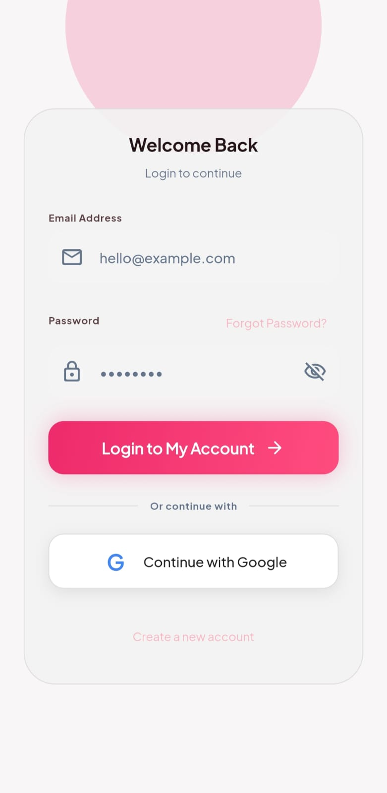
  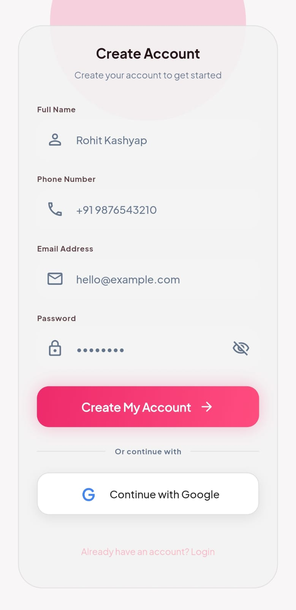
  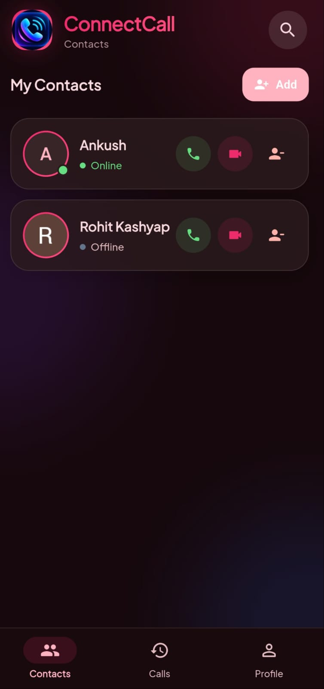
  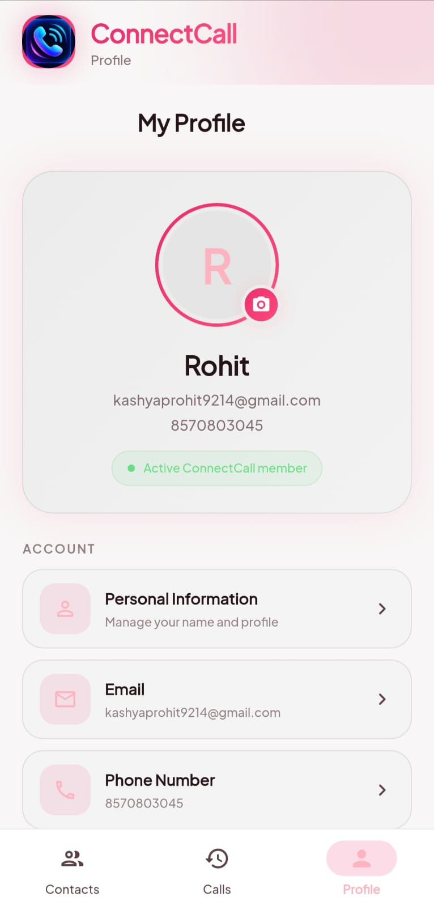
  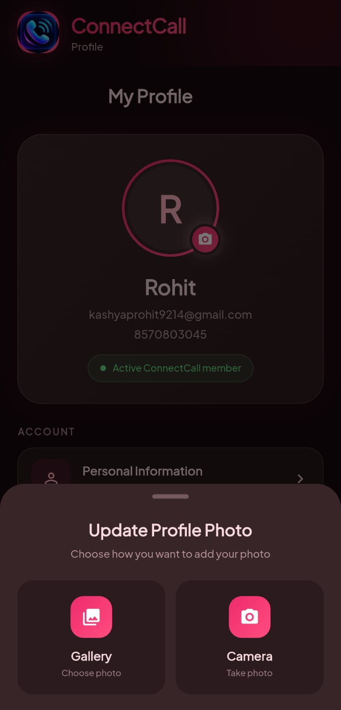
</p>

<p align="center">
  
  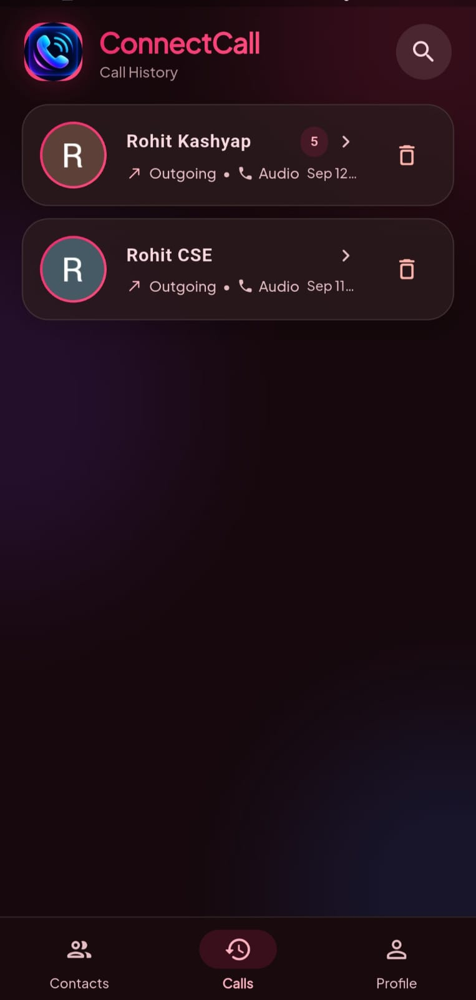
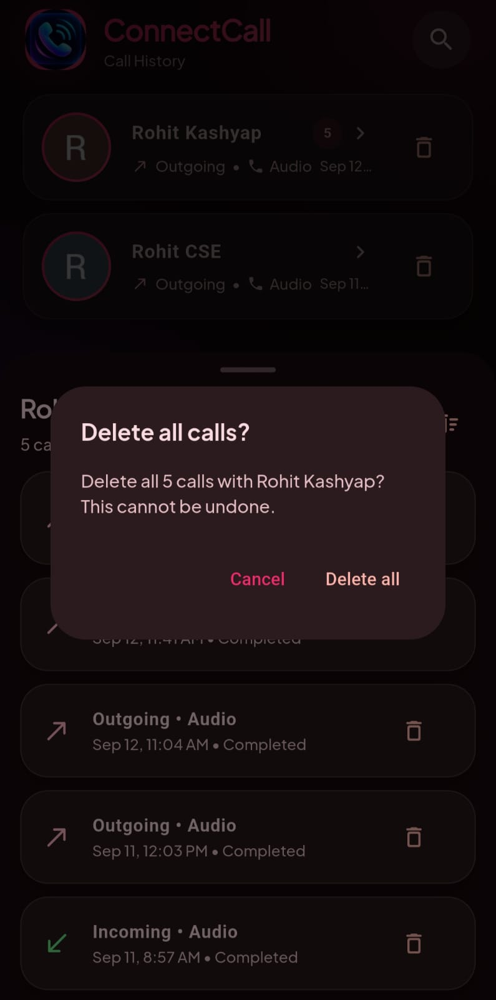
  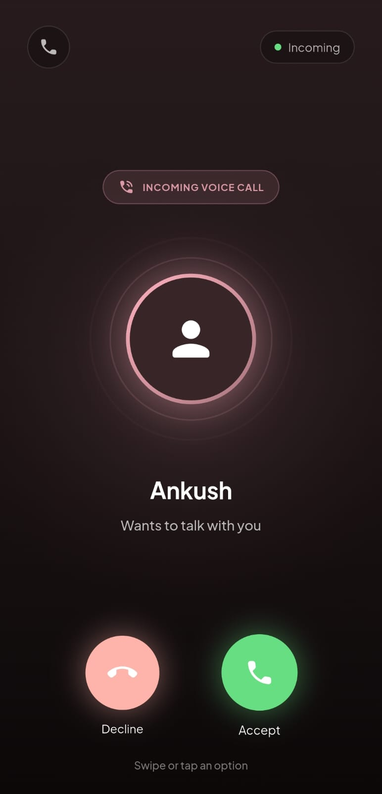
  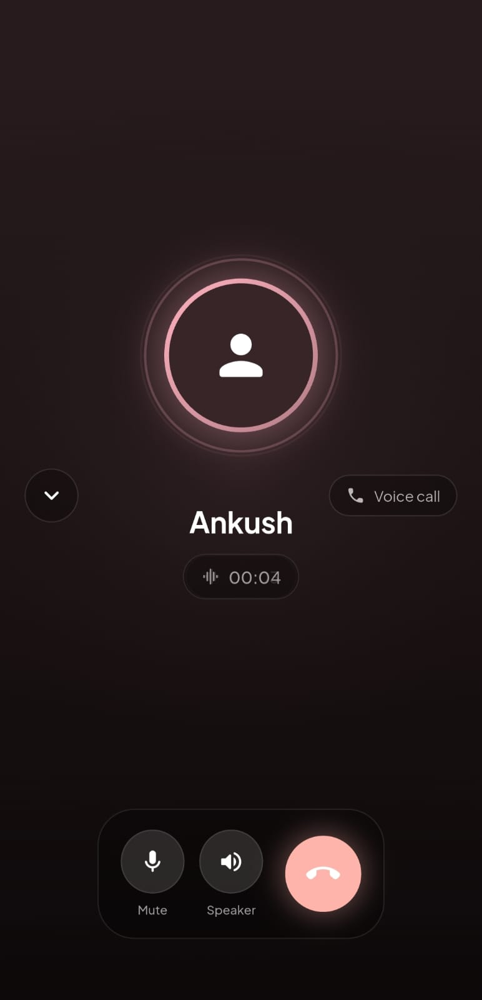
</p>

<p align="center">
  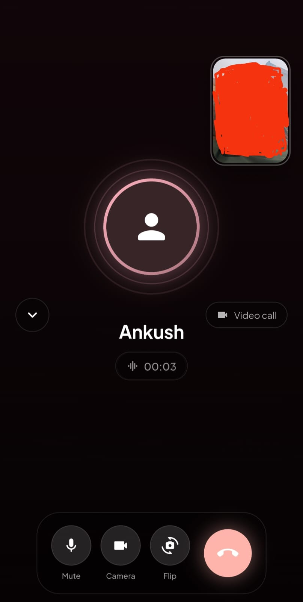
  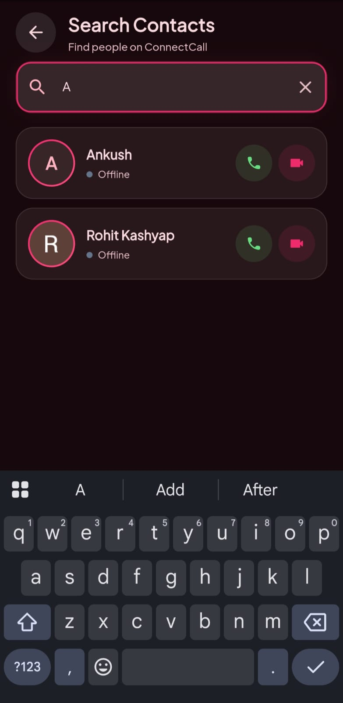
  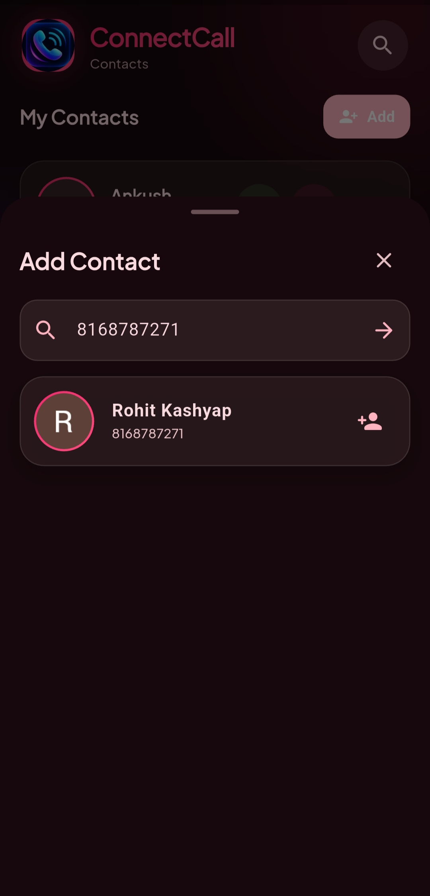
  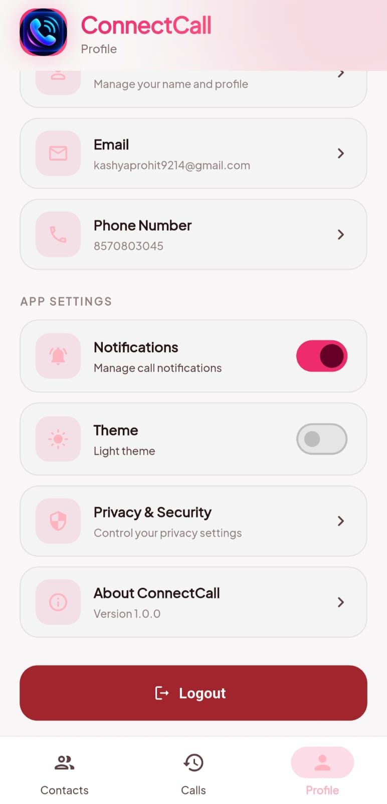
  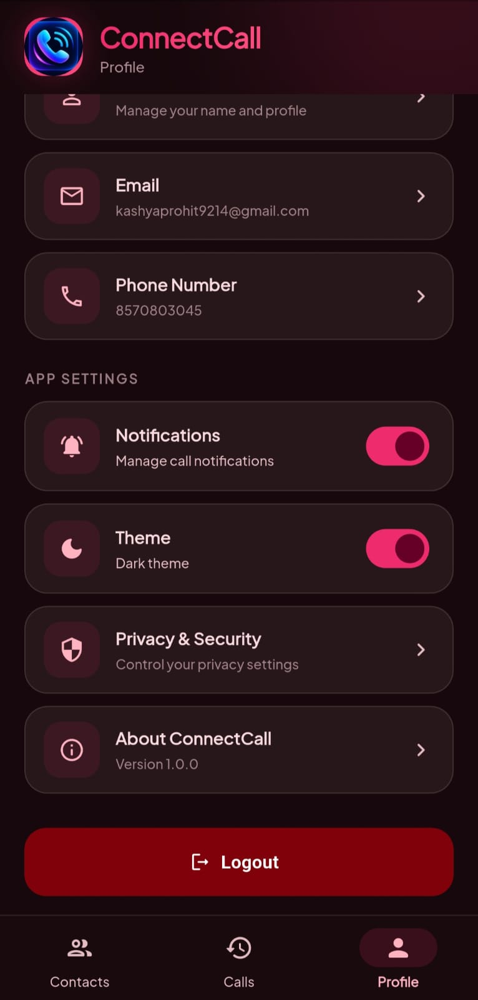
</p>

## 🎬 Demo

<p align="center">

  <a href="assets/screen_recording/calling_app_demo.mp4">
    
  </a>

</p>

<p align="center">
  <b>▶ Click the preview to watch the complete app demonstration</b>
</p>
---

## ✨ Overview

**ConnectCall** is a Flutter-based real-time communication application designed for seamless **audio and video calling**.

The application combines **Flutter, Firebase, WebRTC, Firebase Cloud Messaging, and Riverpod** to provide a smooth calling experience with real-time call status synchronization.

It includes user authentication, contacts, call history, incoming-call notifications, audio/video calls, profile management, and theme customization.

---

## 🚀 Features

### 🔐 Authentication
- Firebase Authentication
- Login & Signup
- User profile creation
- Profile completion flow
- Secure user sessions

### 👥 Contacts
- Search users
- Add contacts
- Contact list
- User profile information
- Online/offline status

### 📞 Calling
- 📱 Audio calling
- 🎥 Video calling
- Incoming call screen
- Accept / Decline calls
- End calls
- Call duration tracking
- Real-time call status
- Automatic call cleanup
- Missed call handling

### 🔔 Notifications
- Firebase Cloud Messaging
- Incoming call notifications
- Background call handling
- Native CallKit integration
- Call accept / decline actions

### 📊 Call History
- Incoming calls
- Outgoing calls
- Call duration
- Call status
- Real-time history updates

### 🎨 UI & Theme
- Modern responsive interface
- Light mode ☀️
- Dark mode 🌙
- Animated call interface
- Clean navigation
- User-friendly design

---

## 🛠️ Tech Stack

| Technology | Purpose |
|---|---|
| **Flutter** | Cross-platform UI |
| **Dart** | Programming language |
| **Firebase Auth** | Authentication |
| **Cloud Firestore** | Real-time database |
| **Firebase Messaging** | Push notifications |
| **WebRTC** | Audio & video communication |
| **Riverpod** | State management |
| **GoRouter** | Navigation |
| **SharedPreferences** | Local preferences |
| **CallKit** | Native call UI |
| **Cloudflare Worker** | Push notification bridge |

---

## 🏗️ Architecture

ConnectCall follows a clean, modular Flutter architecture.

```text
lib/
│
├── core/
│   ├── routes/
│   ├── theme/
│   └── constants/
│
├── models/
│   ├── call_model.dart
│   ├── user_model.dart
│   └── contact_model.dart
│
├── providers/
│   ├── auth_provider.dart
│   ├── call_provider.dart
│   ├── core_providers.dart
│   └── theme_provider.dart
│
├── repositories/
│   ├── call_repository.dart
│   ├── user_repository.dart
│   └── contact_repository.dart
│
├── screens/
│   ├── auth/
│   ├── home/
│   ├── calls/
│   ├── profile/
│   └── search/
│
├── services/
│   ├── notification_service.dart
│   └── ...
│
├── widgets/
│   ├── incoming_call_listener.dart
│   ├── callkit_listener.dart
│   └── fcm_token_sync.dart
│
└── main.dart
```
## 🔄 Calling Flow

```text
        👤 Caller
           │
           ▼
     Start Audio/Video Call
           │
           ▼
     Create Call in Firestore
           │
           ▼
     Send Push Notification
           │
           ▼
        👤 Callee
           │
      ┌────┴────┐
      ▼         ▼
   Accept     Decline
      │         │
      ▼         ▼
   WebRTC     Call Ended
   Session
      │
      ▼
  Audio/Video Call
      │
      ▼
    End Call
      │
      ▼
 Update Firestore
      │
      ▼
  Call History
```
## 🔥 Firebase

The application uses Firebase for real-time communication and user data.

Firebase Services

```text
Firebase
│
├── Authentication
│
├── Cloud Firestore
│
└── Firebase Cloud Messaging
```
**Firestore stores:**

* User profiles
* Contacts
* Call information
* Call status
* WebRTC offers
* WebRTC answers
* ICE candidates
* Call duration

## 🌐 WebRTC

ConnectCall uses WebRTC to establish peer-to-peer audio and video communication.

WebRTC Signaling Flow
```text
Caller
  │
  ├── Create PeerConnection
  │
  ├── Create Offer
  │
  ▼
Firestore
  │
  ▼
Callee
  │
  ├── Receive Offer
  ├── Create Answer
  │
  ▼
Firestore
  │
  ▼
Caller
  │
  ▼
ICE Candidate Exchange
  │
  ▼
🎥 Peer-to-Peer Connection
```
## 🔔 Incoming Call Handling

Incoming calls are synchronized using Firestore and push notifications.

```text
Caller starts call
        │
        ▼
Firestore: ringing
        │
        ├──────────────► FCM Push
        │
        ▼
Callee receives notification
        │
        ▼
Incoming Call Screen
        │
    ┌───┴────┐
    ▼        ▼
 Accept   Decline
    │        │
    ▼        ▼
 Active    Ended
   Call
```
If the caller ends the call before the callee answers:
```text
Caller
  │
  ▼
End Call
  │
  ▼
Firestore status = ended
  │
  ▼
Callee detects status change
  │
  ▼
Incoming screen closes
  │
  ▼
🏠 Home Screen
```
## 🎨 Theme Support

ConnectCall supports both light and dark themes.

**☀️ Light Mode**

Clean and bright interface for daytime usage.

**🌙 Dark Mode**

Dark interface designed for comfortable usage in low-light environments.

The selected theme is stored locally using SharedPreferences.

## 📱 Screens

### Authentication
```text
┌─────────────────────────┐
│      📞 ConnectCall     │
│                         │
│       Login             │
│                         │
│  Email                  │
│  Password               │
│                         │
│      [ Login ]          │
│                         │
│   Create an account     │
└─────────────────────────┘
```
### Home
```text
┌─────────────────────────┐
│  ConnectCall       🔔   │
├─────────────────────────┤
│                         │
│      Contacts            │
│                         │
│   👤 User 1    📞 🎥    │
│   👤 User 2    📞 🎥    │
│   👤 User 3    📞 🎥    │
│                         │
├─────────────────────────┤
│ Contacts │ History │ 👤 │
└─────────────────────────┘
```
### Incoming Call
```text
┌─────────────────────────┐
│                         │
│     📞 Incoming Call    │
│                         │
│          👤             │
│                         │
│       User Name         │
│                         │
│   ❌ Decline   Accept 📞 │
│                         │
└─────────────────────────┘
```
### Active Call
```text
┌─────────────────────────┐
│                         │
│       Video Call        │
│                         │
│          🎥             │
│                         │
│                         │
│  🔇    📹    🔊    ❌   │
│                         │
└─────────────────────────┘
```
## ⚙️ Installation
**1. Clone the repository****
```text
git clone <YOUR_REPOSITORY_URL>
```
****2. Open the project****
```text
cd connect_call
```
****3. Install dependencies****
```text
flutter pub get
```
**4. Configure Firebase**

Add your Firebase configuration files:
```text
android/app/google-services.json
ios/Runner/GoogleService-Info.plist
```
Also configure:
```text
firebase_options.dart
```
**5. Run the application**
```text
flutter run
```
**📦 Build APK**

For Android release:
```text
flutter build apk --release
```
APK will be generated at:
```text
build/app/outputs/flutter-apk/release/app-release.apk
```
## 🔒 Firestore Security

The application protects call documents so users can only access calls in which they are participants.
```text
match /calls/{callId} {
  allow read: if request.auth != null
              && (
                resource.data.callerId == request.auth.uid ||
                resource.data.calleeId == request.auth.uid
              );

  allow create: if request.auth != null
                && (
                  request.resource.data.callerId == request.auth.uid ||
                  request.resource.data.calleeId == request.auth.uid
                );
}
```
## 🧠 State Management

The project uses Riverpod for predictable and reactive state management.

### Important providers include:
```text
authStateProvider
callControllerProvider
incomingCallProvider
callHistoryProvider
themeModeProvider
```
This keeps authentication, calls, call history, and theme state separated and maintainable.

### 📂 Main Call States
```text
Ringing
   │
   ├── Accept ──► Ongoing
   │                 │
   │                 ▼
   │               Ended
   │
   ├── Decline ─► Declined
   │
   └── Timeout ─► Missed
```
## 🧪 Testing

Important scenarios to test:

* User signup
* User login
* Profile creation
* Add contact
* Search user
* Audio call
* Video call
* Accept incoming call
* Decline incoming call
* Caller ends before callee accepts
* Call history
* Call duration
* Missed calls
* Push notification
* Light/Dark theme
* Online/offline status

## 💡 Future Improvements

**Possible future enhancements:**

* 👥 Group calling
* 💬 Real-time chat
* 📎 File sharing
* 🖼️ Profile pictures
* 🔐 End-to-end encryption
* 📱 Better background call handling
* 🌐 TURN server support
* 🔔 Advanced notification controls
* 📈 Call analytics

## 👨‍💻 Developer

| **👤 Developer** | **💼 Role** | **🛠️ Expertise** |
|---|---|---|
|**Rohit Kashyap** | Flutter Developer | Mobile Application Development |